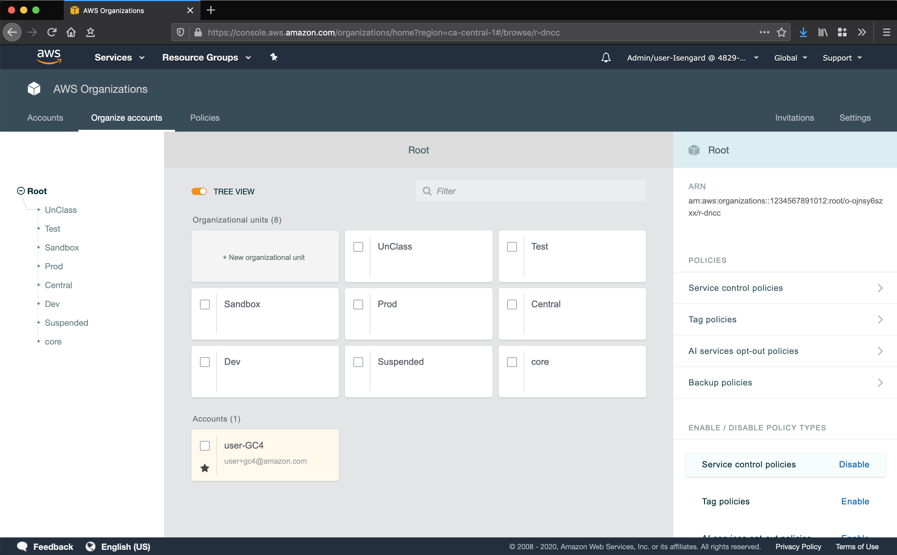
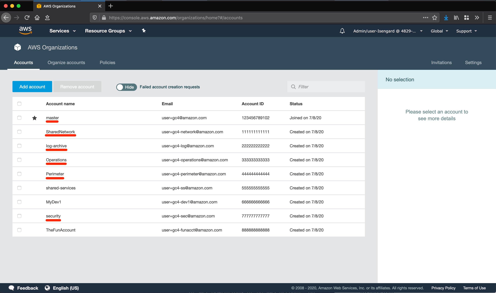
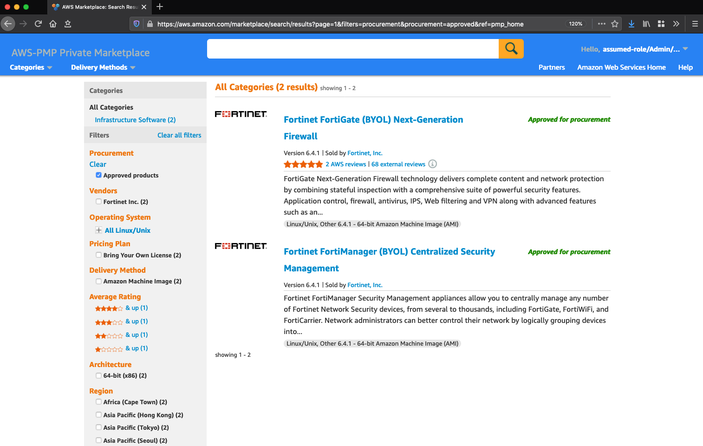

# Account Structure

## Overview

AWS accounts are a strong isolation boundary; by default there is zero control plane or data plane access from one AWS account to another. AWS Organizations is a service that provides centralized billing across a fleet of accounts, and optionally, some integration-points for cross-account guardrails and cross-account resource sharing. The _AWS Secure Environment Architecture_ uses these features of AWS Organizations to realize its design.

## Accounts

The _AWS Secure Environment Architecture_ includes the following AWS accounts.

Note that the account structure is strictly a control plane concept - nothing about this structure implies anything about the network design or network flows.


## Organization Management (root) AWS Account

The AWS Organization resides in the Organization Management (root) AWS account. This account is not used for workloads (to the full extent possible) - it functions primarily as a billing aggregator, and a gateway to the entire cloud footprint for a high-trust principal. There exists a trust relationship between child AWS accounts in the Organization and the Organization Management (root) account; i.e. the child accounts have a role of this form:

```json
{
  "Role": {
    "Path": "/",
    "RoleName": "AWSCloudFormationStackSetExecutionRole",
    "Arn": "arn:aws:iam::111111111111:role/AWSCloudFormationStackSetExecutionRole", // Child account.
    "AssumeRolePolicyDocument": {
      "Version": "2012-10-17",
      "Statement": [
        {
          "Effect": "Allow",
          "Principal": {
            "AWS": "arn:aws:iam::123456789012:root" // Organization Management (root) account may assume this role.
          },
          "Action": "sts:AssumeRole"
        }
      ]
    }
  }
}
```

Note that this is a different role name than the default installed by AWS Organizations (`OrganizationAccountAccessRole`).

### AWS SSO

AWS SSO resides in the Organization Management (root) account in the organization, due to a current requirement of the AWS SSO service. This service deploys IAM roles into the accounts in the Organization. More details on SSO are available in the **Authentication and Authorization** section.

### Organizational Units

Underneath the root of the Organization, Organizational Units (OUs) provide an optional mechanism for grouping accounts into logical collections. Aside from the benefit of the grouping itself, these collections serve as the attachment points for SCPs (preventative API-blocking controls), and Resource Access Manager sharing (cross-account resource sharing).



Example use cases are as follows:

- An SCP is attached to the core OU to prevent the deletion of Transit Gateway resources in the associated accounts.
- The shared network account uses RAM sharing to share the development line-of-business VPC with a development OU. This makes the VPC available to a functional account in that OU used by developers, despite residing logically in the shared network account.

OUs may be nested (to a total depth of five), with SCPs and RAM sharing applied at the desired level. A typical _AWS Secure Environment Architecture_ environment will have the following OUs:

#### Core OU

This OU houses all administrative accounts, such as the core landing zone accounts. No application accounts or application workloads are intended to exist within this OU. This OU also contains the centralized networking infrastructure in the `SharedNetwork` account.

#### Central OU

This OU houses accounts containing centralized resources, such as a shared AWS Directory Service (Microsoft AD) instance. Other shared resources such as software development tooling (source control, testing infrastructure), or asset repositories should be created in this OU.

#### Functional OU: Sandbox

This OU contains a set of Sandbox accounts used by development teams for proof of concept / prototyping work. These accounts are isolated at a network level and are not connected to the VPCs hosting development, test and production workloads. These accounts have direct internet access via an internet gateway (IGW). They do not route through the Perimeter Security services VPC for internet access.

#### Functional OU: UnClass

Accounts in this OU host unclassified application solutions. These accounts have internet access via the Perimeter firewall. This is an appropriate place to do cross-account unclassified collaboration with other departments or entities, or test services that are not available in the Canadian region.

#### Functional OU: Dev

Accounts in this OU host development tools and line of business application solutions that are part of approved releases and projects. These accounts have internet access via the Perimeter firewall.

#### Functional OU: Test

Accounts in this OU host test tools and line of business application solutions that are part of approved releases and projects. These accounts have internet access via the Perimeter firewall.

#### Functional OU: Prod

Accounts in this OU host production tools and line of business application solutions that are part of approved releases and projects. These accounts have internet access via the Perimeter firewall. Accounts in this OU are locked down with only specific Operations and Security personnel having access.

#### Suspended OU

A suspended OU is created to act as a container for end-of-life accounts or accounts with suspected credential leakage. The `DenyAll` SCP is applied, which prevents all control-plane API operations from taking place by any account principal.

## Mandatory Accounts

The _AWS Secure Environment Architecture_ is an opinionated design, which partly manifests in the accounts that are deemed mandatory within the Organization. The following accounts are assumed to exist, and each has an important function with respect to the goals of the overall Architecture (mandatory in red)



### Organization Management (root)

As discussed above, the Organization Management (root) account functions as the root of the AWS Organization, the billing aggregator, attachment point for SCPs. Workloads are not intended to run in this account.

**Note:** Customers deploying the _AWS Secure Environment Architecture_ via the [AWS Secure Environment Accelerator][accel_tool] will deploy into this account. See the [Operations Guide][ops_guide] for more details.

### Perimeter

The perimeter account, and in particular the perimeter VPC therein, functions as the single point of ingress/egress from the PBMM cloud environment to the public internet and/or on-premises network. This provides a central point of network control through which all workload-generated traffic, ingress and egress, must transit. The perimeter VPC hosts next-generation firewall instances that provide security services such as virus scanning, malware protection, intrusion protection, TLS inspection, and web application firewall functionality. More details on can be found in the Networking section of this document.

### Shared Network

The shared network account hosts the vast majority of the AWS-side of the networking resources throughout the _AWS Secure Environment Architecture_. Workload-scoped VPCs (`Dev`, `Test`, `Prod`, etc) are defined here, and shared via RAM sharing to the respective OUs in the Organization. A Transit Gateway provides connectivity from the workloads to the internet or on-prem, without permitting cross-environment (AKA "East:West traffic") traffic (e.g. there is no Transit Gateway route from the `Dev` VPC to the `Prod` VPC). More details on can be found in the Networking section of this document.

### Operations

The operations account provides a central location for the cloud team to provide cloud operation services to other AWS accounts within the Organization and is where an organizations cloud operations team "hangs out" or delivers tooling applicable across all accounts in the organization. It provides ViewOnly access to CloudWatch logs and metrics across the organization. It's where centralized Systems Manager Session Manager Automation (remediation) documents are located. It's where organizations centralize backup automation (if automated), SSM inventory and patch jobs, and where AWS Managed Active Directory would typically be deployed and accessible to all workloads in the organization. In some AWS documentation this is referred to as the Shared Services account.

### Log Archive

The log archive account provides a central aggregation and secure storage point for all audit logs created within the AWS Organization. This account contains a centralized location for copies of every account’s Audit and Configuration compliance logs. It also provides a storage location for any other audit/compliance logs, as well as application/OS logs.

The AWS CloudTrail service provides a full audit history of all actions taken against AWS services, including users logging into accounts. We recommend access to this account be restricted to auditors or security teams for compliance and forensic investigations related to account activity. Additional CloudTrail trails for operational use can be created in each account.

### Security

The security account is restricted to authorized security and compliance personnel, and related security or audit tools. This is an aggregation point for security services, including AWS Security Hub, and serves as the Organization Management (root) for Amazon Guard Duty. A trust relationship with a readonly permission policy exists between every Organization account and the security account for audit and compliance purposes.

### DevOps account and/or Shared Team accounts

Used to deliver CI/CD capabilities - two patterns are depicted in the architecture [diagrams](https://github.com/aws-samples/aws-secure-environment-accelerator/blob/main/docs/architectures/AWS_Diagrams_Account_Network_VPC.md) - The first has a single org wide central CI/CD tooling account, the other has a CI/CD and shared tooling account per major application team/grouping of teams/applications. Which is used will depend entirely on the org size, maturity model, delegation model of the organization and their team structures. We would generally still recommend CI/CD tooling in each developer account (i.e. using Code Commit) and when certain branch names were leveraged, causes the branch/PR to be automatically pulled into the centralized CI/CD tooling account and the approvals and promotion process which will push the code through the SDLC cycle to Test and Prod accounts, etc. Refer to [this](https://aws.amazon.com/blogs/devops/aws-building-a-secure-cross-account-continuous-delivery-pipeline/) blog for more details on automating this pattern.

## Functional Accounts

Functional accounts are created on demand, and placed into an appropriate OU in the Organization structure. The purpose of functional accounts is to provide a secure and managed environment where project teams can use AWS resources. They provide an isolated control plane so that the actions of one team in one account cannot inadvertently affect the work of other teams in other accounts.

Functional accounts will gain access to the RAM shared resources of their respective parent OU. Accounts created for `systemA` and `systemB` in the `Dev` OU would have control plane isolation from each other; however these would both have access to the `Dev` VPC (shared from the `SharedNetwork` account).

Data plane isolation within the same VPC is achieved by default, by using appropriate security groups whenever ingress is warranted. For example, the app tier of `systemA` should only permit ingress from the `systemA-web` security group, not an overly broad range such as `0.0.0.0/0`, or even the VPC range.

## Account Level Settings

The _AWS Secure Environment Architecture_ recommends the enabling of certain account-wide features on account creation. Namely, these include:

1. [S3 Public Access Block][s3-block]
2. [By-default encryption of EBS volumes][ebs-encryption].

## Private Marketplace

The _AWS Secure Environment Architecture_ recommends that the AWS Private Marketplace is enabled for the Organization. Private Marketplace helps administrators govern which products they want their users to run on AWS by making it possible to see only products that comply with their organization's procurement policy. When Private Marketplace is enabled, it will replace the standard AWS Marketplace for all users.



[pbmm]: https://www.canada.ca/en/government/system/digital-government/modern-emerging-technologies/cloud-services/government-canada-security-control-profile-cloud-based-it-services.html#toc4
[ops_guide]: https://github.com/aws-samples/aws-secure-environment-accelerator/blob/main/docs/operations/index.md
[dev_guide]: https://github.com/aws-samples/aws-secure-environment-accelerator/blob/main/docs/developer/developer-guide.md
[accel_tool]: https://github.com/aws-samples/aws-secure-environment-accelerator/blob/main/README.md
[aws_org]: https://aws.amazon.com/organizations/
[aws_scps]: https://docs.aws.amazon.com/organizations/latest/userguide/orgs_manage_policies_type-auth.html#orgs_manage_policies_scp
[aws_vpn]: https://docs.aws.amazon.com/vpn/latest/s2svpn/VPC_VPN.html
[aws_dc]: https://aws.amazon.com/directconnect/
[aws_vpc]: https://aws.amazon.com/vpc/
[aws_tgw]: https://aws.amazon.com/transit-gateway/
[aws_r53]: https://aws.amazon.com/route53/
[ssm_endpoints]: https://aws.amazon.com/premiumsupport/knowledge-center/ec2-systems-manager-vpc-endpoints/
[1918]: https://tools.ietf.org/html/rfc1918
[6598]: https://tools.ietf.org/html/rfc6598
[root]: https://docs.aws.amazon.com/general/latest/gr/aws_tasks-that-require-root.html
[iam_flow]: https://docs.aws.amazon.com/IAM/latest/UserGuide/reference_policies_evaluation-logic.html
[scps]: https://docs.aws.amazon.com/organizations/latest/userguide/orgs_manage_policies_scps-about.html
[ct-digest]: https://docs.aws.amazon.com/awscloudtrail/latest/userguide/cloudtrail-log-file-validation-intro.html
[ebs-encryption]: https://docs.aws.amazon.com/AWSEC2/latest/UserGuide/EBSEncryption.html#encryption-by-default
[s3-block]: https://docs.aws.amazon.com/AmazonS3/latest/dev/access-control-block-public-access.html#access-control-block-public-access-options
[flow]: https://docs.aws.amazon.com/vpc/latest/userguide/flow-logs.html
[gd-org]: https://docs.aws.amazon.com/guardduty/latest/ug/guardduty_organizations.html
[config]: https://docs.aws.amazon.com/config/latest/developerguide/WhatIsConfig.html
[config-org]: https://docs.aws.amazon.com/organizations/latest/userguide/services-that-can-integrate-config.html
[found]: https://docs.aws.amazon.com/securityhub/latest/userguide/securityhub-standards-fsbp-controls.html
[pci]: https://docs.aws.amazon.com/securityhub/latest/userguide/securityhub-pci-controls.html
[cis]: https://docs.aws.amazon.com/securityhub/latest/userguide/securityhub-cis-controls.html
[ssm]: https://docs.aws.amazon.com/systems-manager/latest/userguide/session-manager.html
